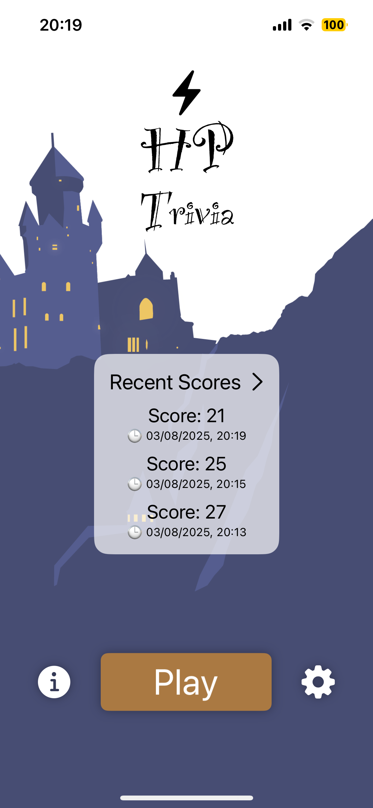
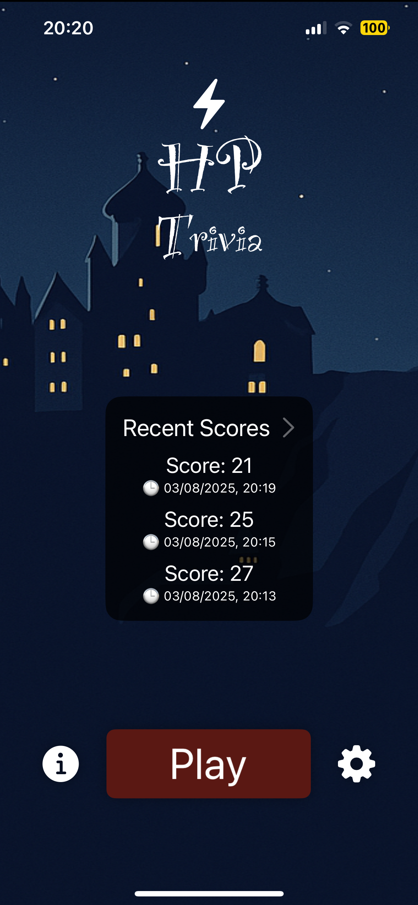
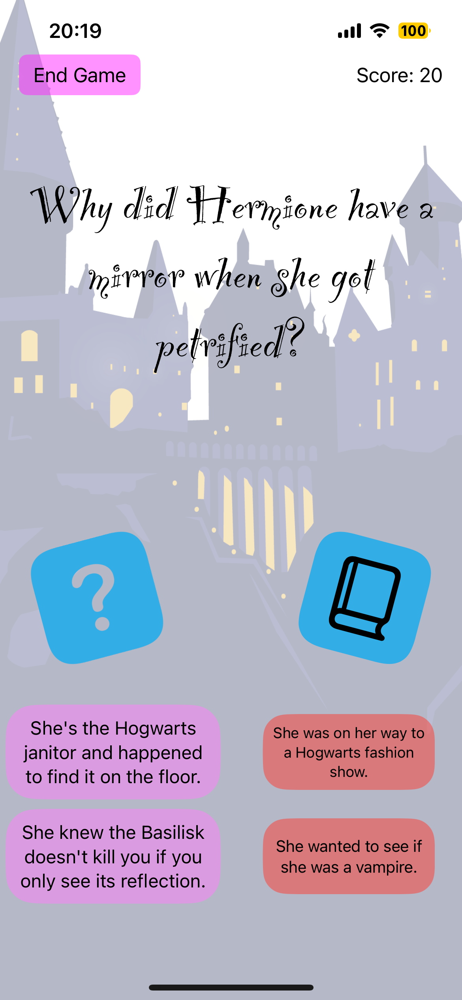
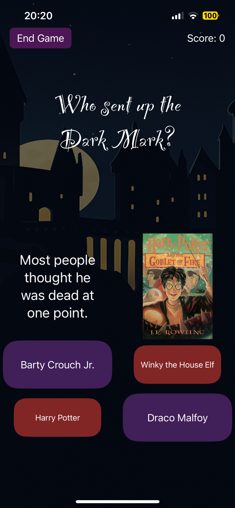
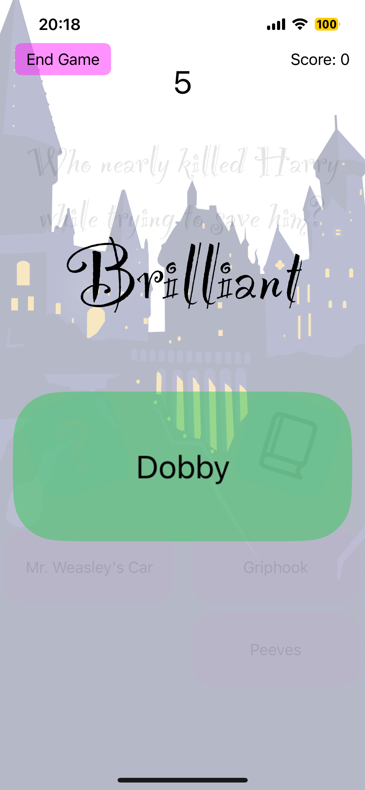
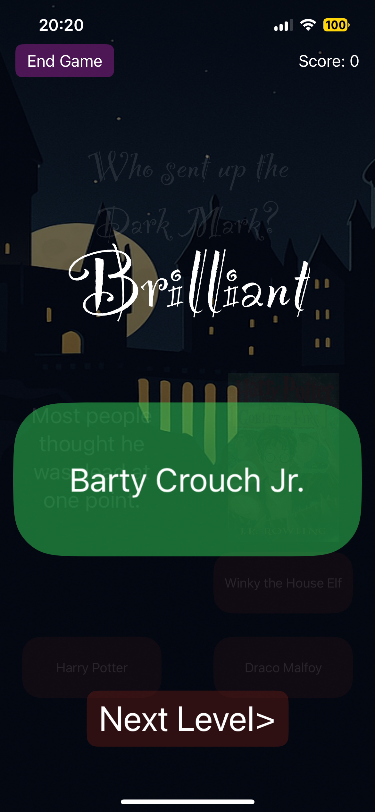

# 🧙‍♂️ Harry Potter Trivia Game (iOS)

An interactive, animated Harry Potter-themed trivia game built with **SwiftUI** and integrated with **Firebase Realtime Database**. Players answer multiple-choice questions, earn points, and view their score history - complete with sound effects, dynamic animations, and support for dark mode.

---

## 📸 Screenshots

### 🎮 Gameplay

<table>
  <tr>
    <td align="center"></td>
    <td align="center"></td>
  </tr>
  <tr>
    <td align="center">*Starting a new trivia round with animated UI*</td>
    <td align="center">*Same screen in dark mode*</td>
  </tr>
</table>

---

### ❓ Question + Hint + Book Reveal

<table>
  <tr>
    <td align="center"></td>
    <td align="center"></td>
  </tr>
  <tr>
    <td align="center"></td>
    <td align="center"></td>
  </tr>
  <tr>
    <td align="center">*Question screen with hint & book icons*</td>
    <td align="center">*Hint revealed in dark mode*</td>
  </tr>
</table>

---

### 📊 Score History

<table>
  <tr>
    <td align="center"></td>
    <td align="center"></td>
  </tr>
  <tr>
    <td align="center">*Recent scores with timestamp*</td>
    <td align="center">*Dark mode version of score list*</td>
  </tr>
</table>

---

### 📖 Instructions + Book Reveal

<table>
  <tr>
    <td align="center"></td>
    <td align="center"></td>
  </tr>
  <tr>
    <td align="center"></td>
    <td align="center"></td>
  </tr>
  <tr>
    <td align="center">*Onboarding and book hints – light mode*</td>
    <td align="center">*Dark mode variant*</td>
  </tr>
</table>

---
## ✨ Features

- 🎮 Engaging quiz gameplay with visual feedback and transitions
- 📦 Loads questions from Firebase (with JSON fallback)
- 🧠 Interactive hints and book references
- 📊 Realtime score saving & chronological score history
- 📱 Responsive layout for all screen sizes
- 🌙 Full dark mode support
- 🔊 Magical sound effects for right/wrong answers and actions

---

## 🔧 Technologies Used

### 🧱 Frameworks & Languages
- [Swift 5.9](https://swift.org)
- [SwiftUI](https://developer.apple.com/xcode/swiftui/)

### ☁️ Backend
- [Firebase Realtime Database](https://firebase.google.com/products/realtime-database)
    - Stores trivia questions
    - Stores all score history

### 🔊 Media
- AVFoundation: for background music and sound effects

---

## 🚀 Getting Started

### 1. Clone the repository
```bash
git clone https://github.com/your-username/harry-potter-trivia-ios.git
